# MyMyTools

軽量なクロスプラットフォーム多目的 GUI ツール (個人用ローカルツール)。
保存系ツール8種と、変換・解析・生成・通信などのツール17種を、一機能一モジュールで統合。

- **対象 OS**: macOS / Windows (Linux は対象外)
- **配布形式**: portable 差し替え方式 (自動更新なし)
- **図編集**: Mermaid 11.17.2 / draw.io 31.5.3を全資産同梱で完全オフライン実行
- **PNG最適化**: 自作の shotq を内蔵し、`shotq --quality=70-85 --speed 11` と同じ結果をファイル単位・フォルダ単位で得る (ADR-0023)
- **データ保存**: ローカル SQLite (アプリ実行ファイルとは別ディレクトリ)
- **ライセンス**: MIT

## 画面

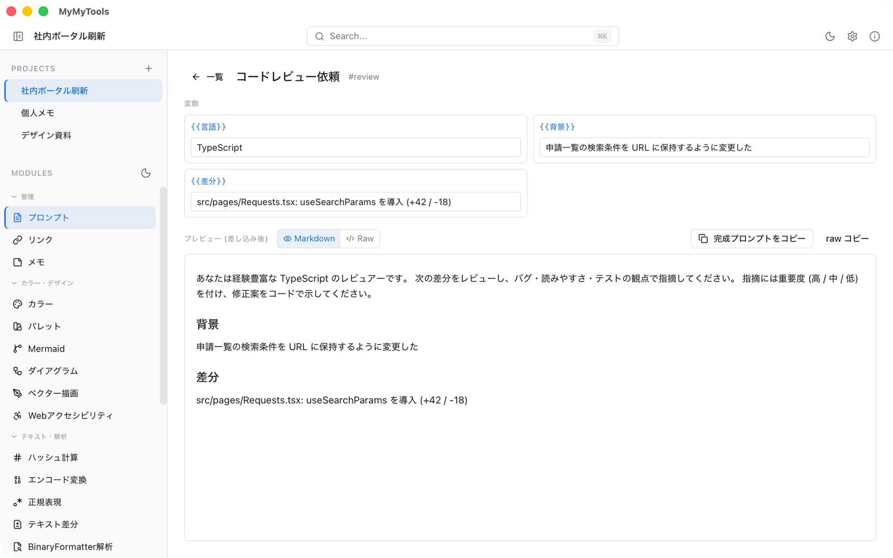

プロジェクトごとにプロンプト・リンク・メモ・カラーなどを保存し、左のサイドバーからカテゴリ別のツールを切り替えます。画面はデモ用のデータで撮った macOS 版です ([撮り方](docs/images/screenshots/README.md))。

<table>
  <tr>
    <td width="50%">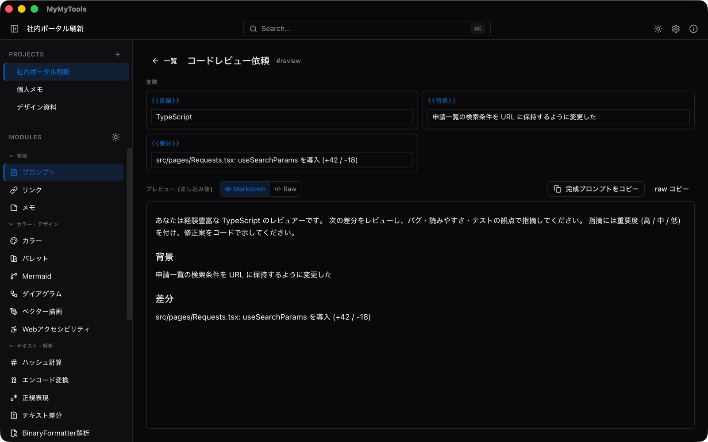<br><b>ダークテーマ</b>: ライト / ダーク / OS の設定に合わせる、から選べます</td>
    <td width="50%">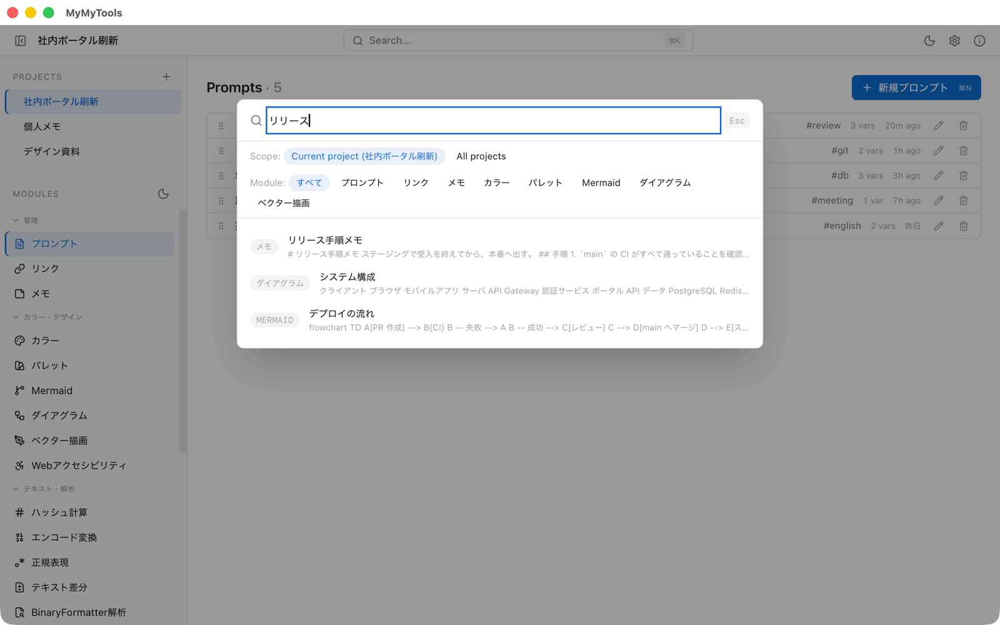<br><b>横断検索 (⌘K)</b>: 保存したアイテムを、モジュールをまたいで全文検索します (現在のプロジェクト / 全プロジェクト)</td>
  </tr>
  <tr>
    <td width="50%">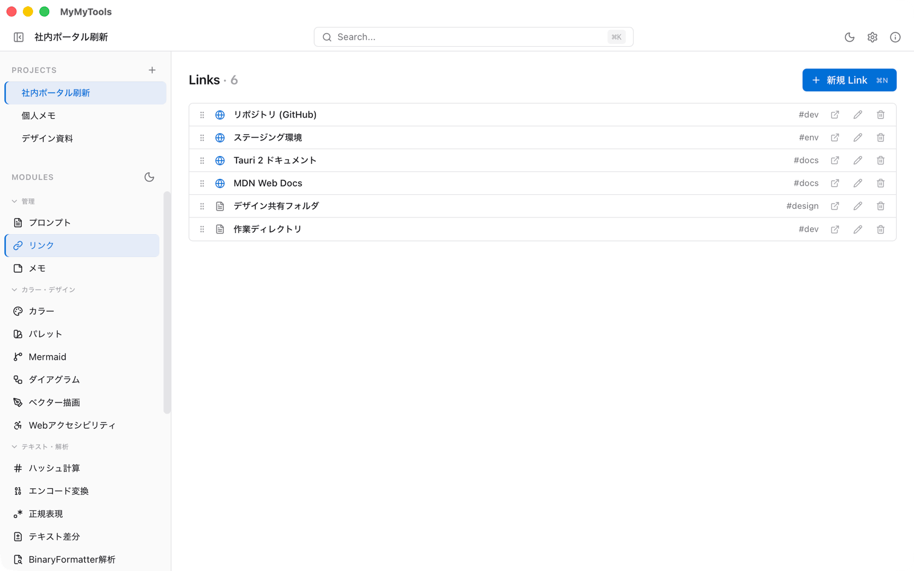<br><b>リンク</b>: URL とファイル・フォルダのパスを整理し、ブラウザや Finder / Explorer で開きます</td>
    <td width="50%">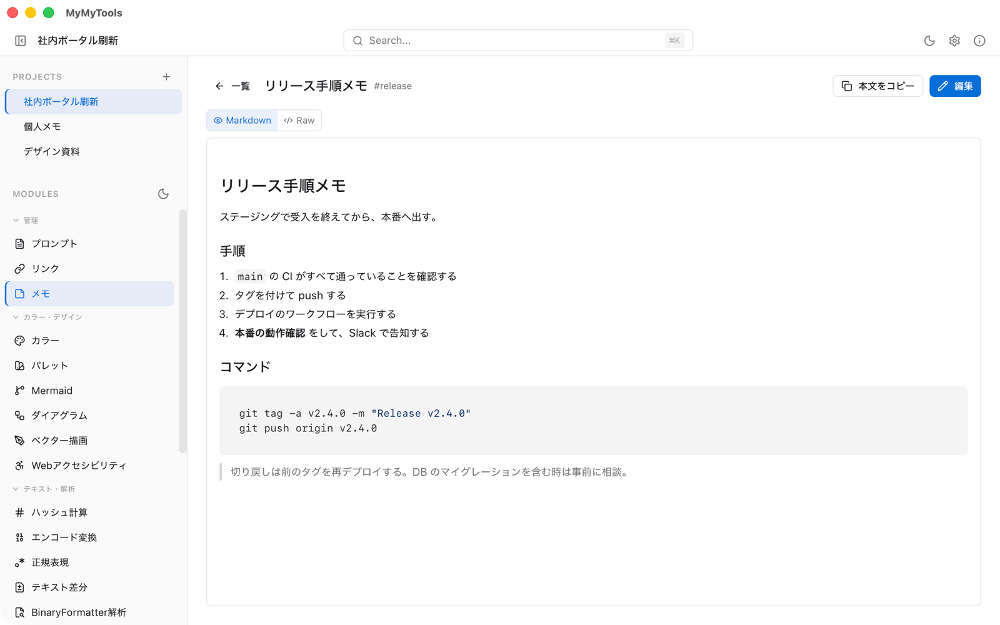<br><b>メモ</b>: Markdown で書き、表示と元のテキストを切り替えられます</td>
  </tr>
  <tr>
    <td width="50%">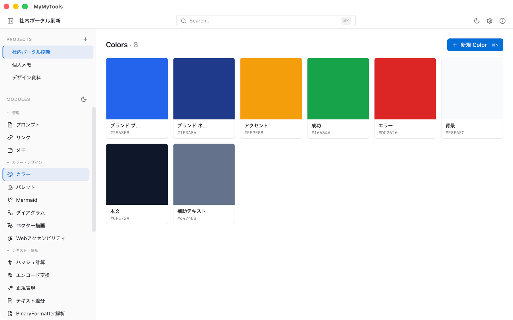<br><b>カラー</b>: 色を名前付きで保存し、HEX / RGB / HSL / OKLCH を相互に変換します</td>
    <td width="50%">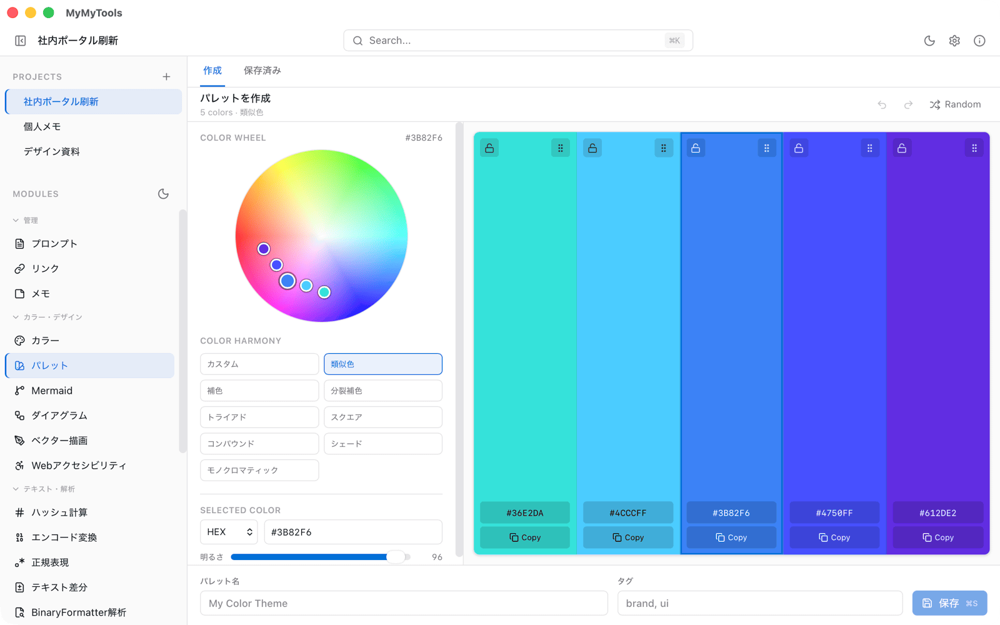<br><b>パレット</b>: カラーホイールと配色ルール (類似色・補色など) で 5 色のパレットを作ります</td>
  </tr>
  <tr>
    <td width="50%">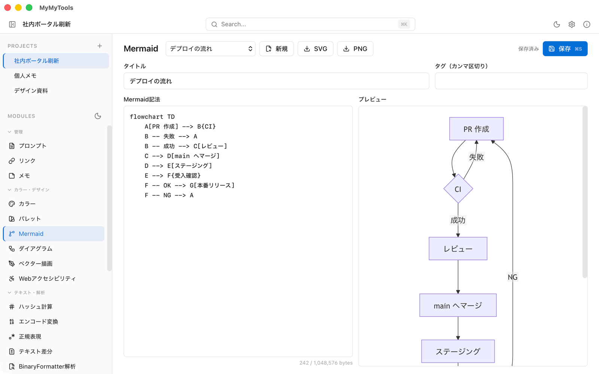<br><b>Mermaid</b>: 記法を書きながらプレビューし、SVG / PNG に書き出します</td>
    <td width="50%">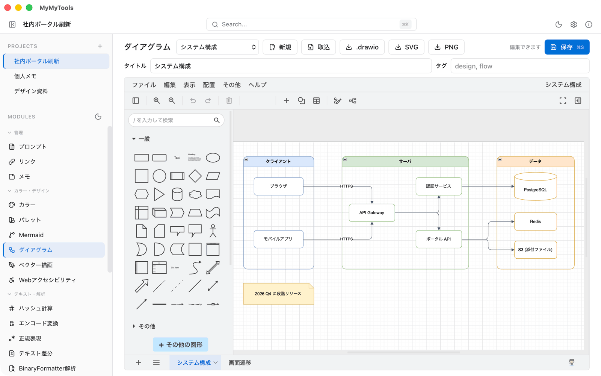<br><b>ダイアグラム</b>: draw.io を同梱し、ネットワークに出ずに図を描きます。.drawio / SVG / PNG で入出力</td>
  </tr>
  <tr>
    <td width="50%">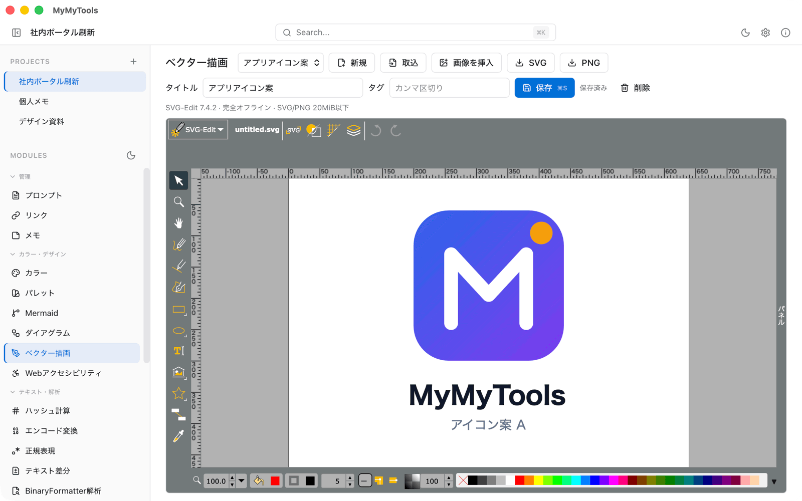<br><b>ベクター描画</b>: SVG-Edit を同梱し、SVG を描いて SVG / PNG で書き出します</td>
    <td width="50%">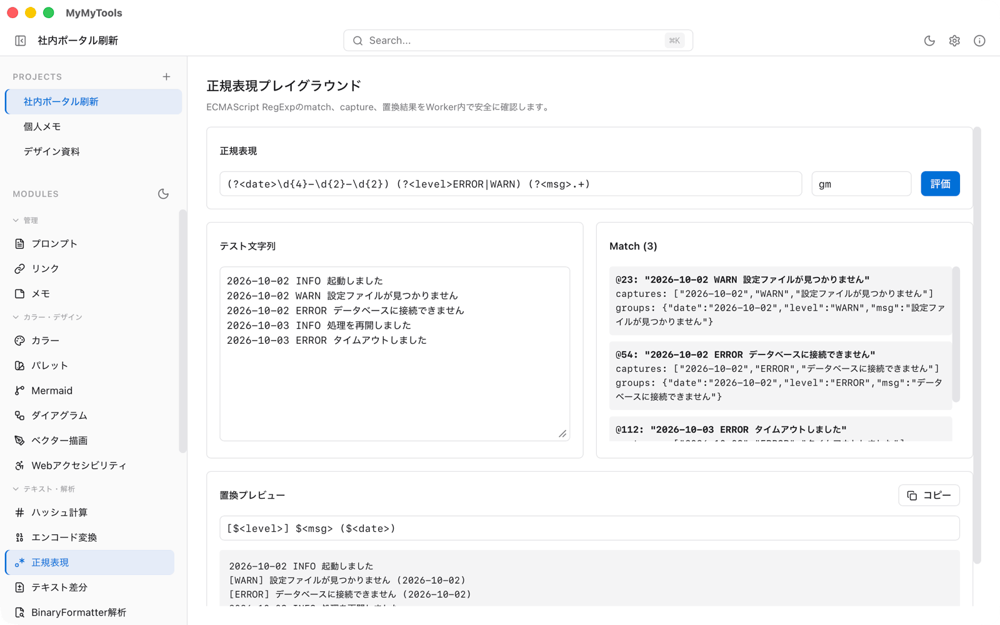<br><b>正規表現</b>: マッチ・名前付きグループ・置換の結果をその場で確かめます</td>
  </tr>
  <tr>
    <td width="50%">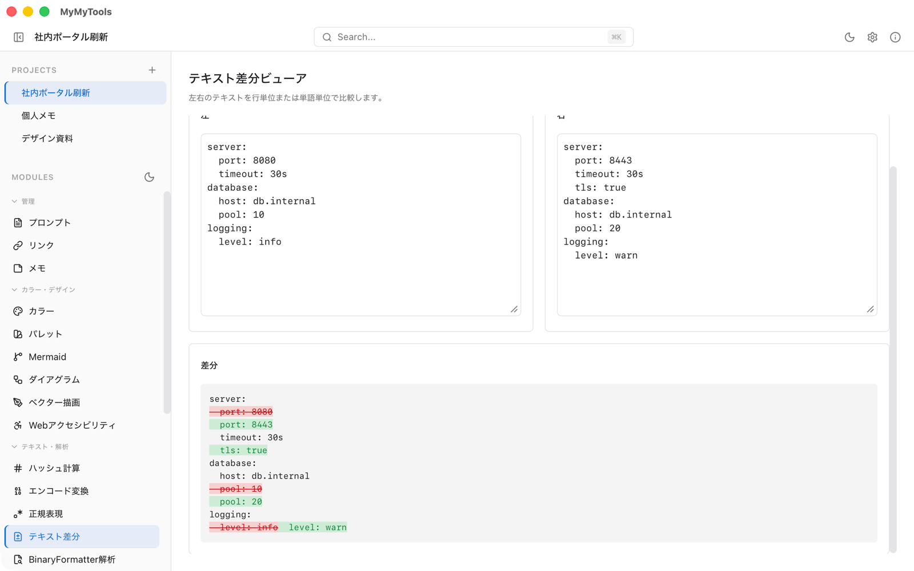<br><b>テキスト差分</b>: 2 つのテキストを行単位などで比べます。空白や大文字・小文字の違いも無視できます</td>
    <td width="50%">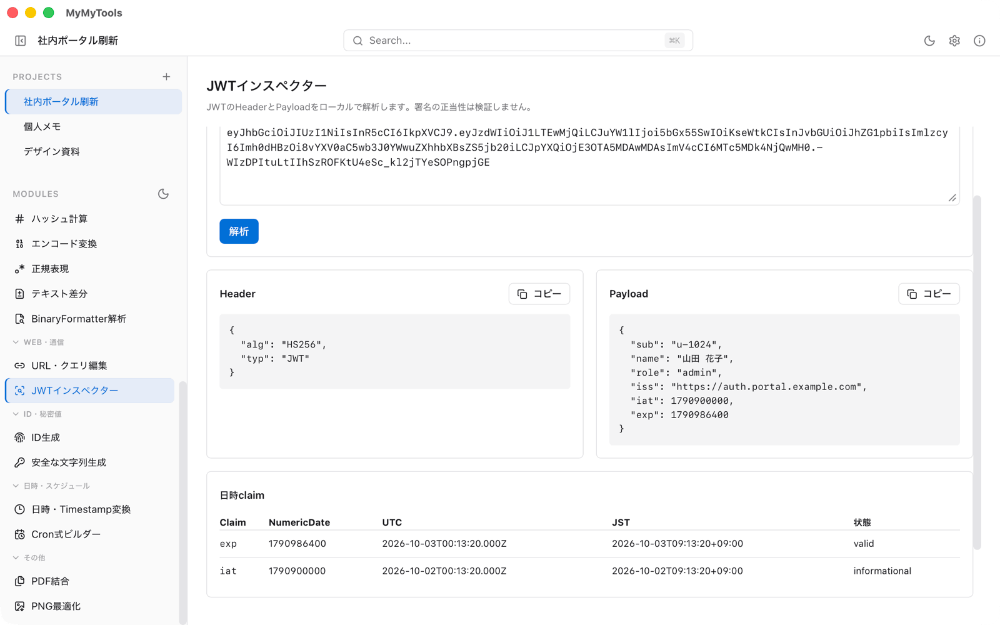<br><b>JWT インスペクター</b>: Header / Payload と日時の claim を表示します (署名は検証しません)</td>
  </tr>
  <tr>
    <td width="50%">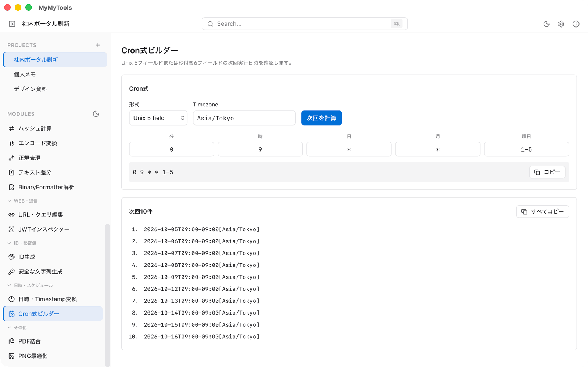<br><b>Cron 式ビルダー</b>: タイムゾーンを指定して、次回の実行日時を 10 件表示します</td>
    <td width="50%">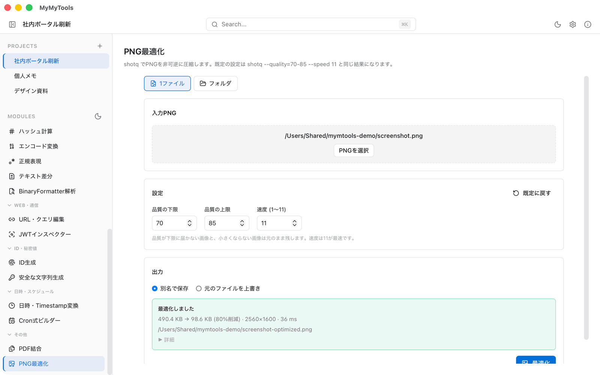<br><b>PNG 最適化</b>: 内蔵の shotq で PNG を減色・圧縮します。ファイル単位とフォルダ単位に対応</td>
  </tr>
  <tr>
    <td width="50%">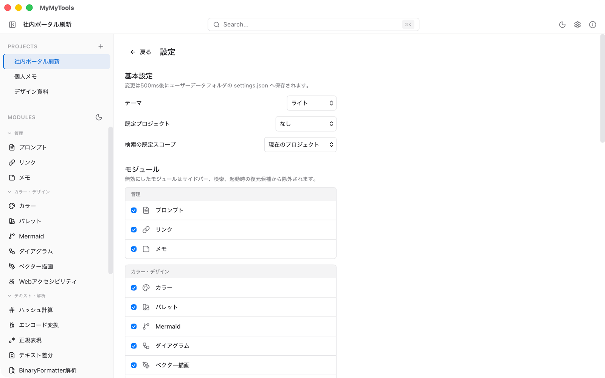<br><b>設定</b>: モジュールの有効 / 無効、表示、バックアップ、JSON のエクスポート / インポート</td>
    <td width="50%"><b>ほかのツール</b>: ハッシュ計算、エンコード変換、URL・クエリ編集、日時・Timestamp 変換、ID 生成、安全な文字列生成、Web アクセシビリティ、PDF 結合、BinaryFormatter 解析、文字数カウント、テキスト整形、HTTP (既定は無効)</td>
  </tr>
</table>

## ドキュメント

| 文書 | 内容 |
|------|------|
| [docs/requirements.md](docs/requirements.md) | 何を作るか / 作らないか、決定事項 D-01〜D-14 |
| [docs/architecture.md](docs/architecture.md) | プロセス / スレッドモデル、レイヤ責務 |
| [docs/data-model.md](docs/data-model.md) | SQLite スキーマ、payload バージョニング、エクスポート JSON |
| [docs/module-contract.md](docs/module-contract.md) | モジュール / コア境界の API 契約 |
| [docs/ui-design.md](docs/ui-design.md) | UI トークン、画面スケルトン、キーボードショートカット |
| [docs/developer-tools-plan.md](docs/developer-tools-plan.md) | 開発ツールモジュールの範囲、段階、品質条件 |
| [docs/release-process.md](docs/release-process.md) | 担当者向けの手動リリース手順、公開後検証、失敗時対応 |
| [docs/decisions/](docs/decisions/) | ADR-0001〜0023 (モジュール化 / ローカル処理境界 / リリース方式) |
| [CLAUDE.md](CLAUDE.md) | 作業時の不変条件と参照優先順位 |

## 開発

### 必要環境

- Node.js **22 系** LTS (`.nvmrc` 参照)
- Rust **1.88+** stable (`rust-toolchain.toml` / `src-tauri/Cargo.toml` の `rust-version` 参照)
- macOS は Xcode CLT、Windows は MSVC build tools

### セットアップ

```bash
npm install
```

### よく使うコマンド

```bash
npm run tauri:dev          # 開発モード (Vite + Tauri)
npm run tauri:build        # リリースビルド
npm run lint               # ESLint + Prettier (check)
npm run lint:fix           # ESLint + Prettier (auto-fix)
npm run typecheck          # tsc --noEmit
npm run test               # Vitest (run once)
npm run test:watch         # Vitest (watch)
```

Rust 側:

```bash
cd src-tauri
cargo fmt --check
cargo clippy --all-targets --all-features --locked -- -D warnings
cargo test --workspace --lib --all-features --locked
```

## 手動リリース

リリースはGitHub Actionsの`Release (ref: ADR-0013)`を`main`から手動実行する。
担当者向けの準備、PR、tag作成、実行、公開確認、失敗時対応は
[docs/release-process.md](docs/release-process.md)にまとめている。

1. `package.json` / `src-tauri/Cargo.toml` / `src-tauri/tauri.conf.json`のversionを同じSemVerへ更新
2. 変更を`main`へ反映し、`v<version>`タグをpush
3. Actions画面でversionを入力してworkflowを実行 (`v`は省略可)

入力・タグ・3設定のversionが一致し、macOS / Windowsの両ビルドが成功した場合だけ、
`MyMyTools_<version>_macos_aarch64.zip`と`MyMyTools_<version>_windows_x64.zip`を公開する。
既存のGitHub Releaseは上書きしない。

## 開発状況

**Phase 1 の主要機能を実装済み (`0.1.0-alpha.21`)**。

Tauri 2 + React 19 + TypeScript + Tailwind v4 + Zustand のフロントエンドと、
rusqlite (bundled) + FTS5 / tokio + tokio-util / tracing / lopdf / shotq (PNG最適化、`src-tauri/crates/shotq` に複製) の Rust バックエンドで構成。
プロジェクト管理、カテゴリ表示付き25モジュール、横断検索、`settings.json`、バックアップ、
アプリ全体／プロジェクト単位の JSON export / import を備える。

CI 6 ジョブ (lint-rust / test-rust / lint-frontend / test-frontend / build-tauri ×2)
と main ブランチ保護を ADR-0010 §2.8 に従って GitHub 側で運用中。
PR 経由マージのみ受付け、6 ジョブ全 green が必須。

## 関連

- [Tauri 2 公式](https://v2.tauri.app/)
- リリース告知・配布: GitHub Releases (portable ZIP / 手動更新)

ベクター描画はSVG-Edit 7.4.2を同梱し、作品のプロジェクト保存とSVG/PNG入出力に対応します。[設計境界](docs/decisions/0021-offline-vector-editor.md)と[検証・実機受入](docs/vector-editor-verification.md)を参照してください。
